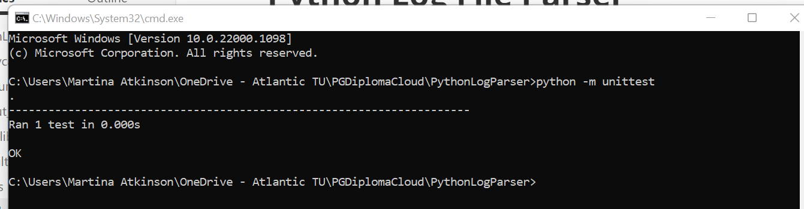

# Python Log Parser

The purpose of the project was to identify every device on a client (192.168.5.0/24) and CCTV (192.168.12.0/24) networks using the DHCP Server logs and output the results to a CSV file. 

The log file was parsed to extract the required IP address, MAC address and node name (if available).  Duplicates were excluded and devices were uniquely identified by their MAC address, with the first 24 bits, known as an Organisational Unique Identifier (OUI), used to identify the manufacturer of the network card with the aid of the  [MAC Address Website](https://macaddress.io), for example, c8:4b:d6 is Dell. The manufacturer details were added to the nodes.csv file. 

### Details

1. A variable was created to hold the log file name, dhcpd.log, and the file was opened for reading. A variable was created to hold the results filename, nodes.csv, and this file was opened for writing.

3. Using a for loop to read every line, the relevant information on each line was extracted. This was from position 34 to the end of the line (e.g. "DHCPREQUEST ...") and assigned to a variable called line_remainder.

   ```
   for individual_line in read_file:
       # line remainder taking 34 characters onwards
       line_remainder = individual_line[34:] 
       # space character used to split input data into an array 
   Example: DHCPREQUEST for 192.168.5.168 from c8:4b:d6:0a:77:2d (A-76MRRL3) via eth0    
   ```

3. The space character (" ") and Python split function were used to split the remaining data into an array of the individual values.

   ```
    # space character used to split input data into an array 
       segments = line_remainder.split(' ')
   ```

4. Processing of data varied according to record type, e.g. DHCPREQUEST, DHCPACK, uid, as the position of the relevant data varied with each record type. 

   ```
   #check for record type uid
       if record_type == "uid":
           mac_address = segments[5]
   
       # check for record type DHCPOFFER at index 4
       if record_type ==  "DHCPOFFER":       
           mac_address = segments[4]  
   ```

5. A function, provided by the lecturer, was used to strip out unnecessary brackets in the data.

   ```
   def remove_brackets(string_with_brackets):
   	"" remove bracket"""
       string_without_brackets = str(string_with_brackets.strip('('))
       string_without_brackets = str(string_without_brackets.strip(')'))
       return string_without_brackets
   ```

6. A function called get_manufacturer was created to store the OUI code and manufacturer as key-value pairs in a Python dictionary.  This function was used to look up the matching manufacturer to populate details to the nodes.csv file or return "unknown" if no manufacturer was found.

   ```
   def get_manufacturer(mac_value: str)->str:
       # create a dictionary item to hold the QUI Codes
       my_dictionary = {"BC:5F:F4": "ASRock Incorporation", "C8:4B:D6": "Dell"}
      
       if len(mac_value) > 8:
           mac_value = mac_value[0:8]
           # convert mac address form the input log to uppercase
       convert_mac_to_uppercase =  mac_value.upper()
       
       # if the mac address is in the dictionary return the value
       if convert_mac_to_uppercase in my_dictionary:
           # if found return value that matches the QUI key
           return(my_dictionary[convert_mac_to_uppercase])
       else:
           return "unknown"
   ```

   

7. Duplicate entries were avoided,  by maintaining a list of MAC addresses already found and processed. 

   ```
      if len(mac_address) > 0:
           # only valid addresses come in 
           if mac_address in list_of_addresses_found:
               # Check if mac_address already added - is so ignore - removes duplicates
               pass
   
           else:
               # add the mac_address the list of already found mac_address        
               list_of_addresses_found.append(mac_address)
   ```

### Results (nodes.csv)

Six unique devices were identified and stored in the nodes.csv

```python
c8:4b:d6:0a:77:2d	192.168.5.168	A-76MRRL3	Dell
18:68:cb:45:1a:ae	192.168.12.152				Hangzhou
b8:27:eb:b4:81:6d	192.168.5.172	kali		Rasberry PI
c0:25:a5:66:81:fc	192.168.5.21				Dell
a4:4c:c8:50:c3:6b	192.168.5.164				Dell
bc:5f:f4:45:7c:1e	192.168.5.10				ASRock Incorporation

```

### Testing

Testing was completed on the get_manufacturer function using Python Unittest and ran from the command line. The test was stored in a test package folder.  

```python
Test Function:
class TestFormatter(unittest.TestCase): 
    def test_1(self): 
        test_text =  "C8:4B:D6:AA:BB:CC" 
        result = my_library.get_manufacturer(test_text) 
        self.assertEqual(result, "Dell") 
        
Command:        
python -m unittest
```



### Project Status

All tasks were completed successfully.  Future development would involve getting the OUI and manufacturer dynamically via an API call to the [MAC Address Website](https://macaddress.io),  rather than from a dictionary item that has to be updated manually. 


