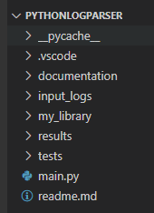

# Python Log File Parser

The purpose of the project was to identify every device on a network using a DHCP server log and output the results to a CSV file. 

The log file was parsed to extract the required IP address, MAC address and node name (if available).  The first 24 bits of the MAC address, known as the Organisational Unique Identifier (OUI), were used, with the aid of the [MAC Address Website](https://macaddress.io), to identify the manufacturer which was added to the output file.

### Directory Structure

The documentation folder contains a status.md file with code details and project status. The input file, dhcpd.log, is stored in the input_logs folder and the output file, nodes.csv, is in the results folder.  Functions are saved and imported from the my_library folder. The tests folder contains a Python Unitttest file. The main.py file at the root of the directory contains the main code for the project. 

### Requirements 

- Python 3.10.7 (64-bit)
- Editor to run the code such as Notepad ++ or Visual Studio Code
- Zipping software such as 7Zip to unzip the code files. 

### Aims

1. Open the input file, dhcpd.log, for reading and open the output file, nodes.csv to write.
2. Use a loop to read each line in the input file and extract the relevant portion for processing.
3. Use the space character (" ") and Python slicing function to output the remaining segment of each line into an array of individual values. 
4. Use the first value or record type, e.g. DHCPREQUEST, DHCPACK, to extract the MAC address, IP address and hostname (if available) for each line, with techniques varying with record type.
5. Use the supplied function, to clean up data through the removal of brackets
6. Create a MAC address function to identify the manufacturer using the MAC address, OUI code, 
   [MAC Address Website](https://macaddress.io), and Python dictionary item.
7. Filter the devices to ensure duplicate items are not added to the nodes.csv file.

### Project Status

All tasks were completed successfully in line with project specifications.  Further development is required to retrieve the manufacturer details automatically from the [MAC Address Website](https://macaddress.io), using an API rather than using a dictionary item which requires manual updating. 

### Author

Martina Atkinson, L00177769. Version Number:1. Date: 12/11/2022
